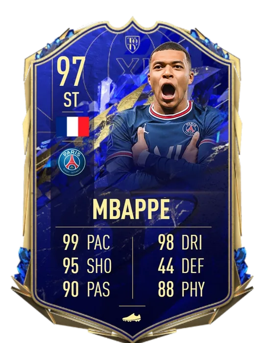

<!-- README.md -->

<h1 id="top" align="center"> Clustering of Football Players Similar to 'Kylian Mbappé' using K-means and GMM Algorithms </h1>
<h3 align="center">This project analyses an engineered dataset of aggregated player performance from FBref, using pandas for data manipulation through DataFrames, matplotlib for data visualisation, and scikit-learn for Machine Learning, to cluster the data to find players similar to 'Kylian Mbappé'. </h3>  

 

<!-- TABLE OF CONTENTS -->
<h2 id="table-of-contents"> :book: Table of Contents</h2>

  
Table of Contents

  <ol>
    <li><a href="#introduction">1. Introduction</a></li>
    <li><a href="#literature-review">2. Literature Review</a></li>
    <li><a href="#data-processing">3. Data Processing</a>
     <ul>
          <li><a href="#data-source">3.1 Data Source</a>
          <li><a href="#data-description">3.2 Data Description</a>
          <li><a href="#data-preprocessing">3.3 Data Preprocessing</a>
          <li><a href="#feature-selection">3.4 Feature Selection</a>
          <li><a href="#data-normalization">3.5 Data Normalization</a>
          <li><a href="#dimensionality-reduction">3.6 Dimensionality Reduction using PCA</a>
     </ul>
    </li>
    <li><a href="#learning-methods">4. Learning Methods</a>
    <ul>
          <li><a href="#kmeans">4.1 K-means</a>
          <li><a href="#gmm">4.2 Gaussian Mixture Model (GMM)</a>
     </ul>
    </li>
    <li><a href="#Analysis">5. Analysis</a>
    <ul>
          <li><a href="#analysis-1">5.1 Analyzing Kylian Mbappé's Performance over the Last 5 Seasons</a>
          <li><a href="#analysis-2">5.2 Closest Performing Players in the Last 5 Seasons</a>
          <li><a href="#analysis-3">5.3 Closest Performing Players in the Current Season (2022-2023)</a>
          <li><a href="#analysis-4">5.4 Closest Performing Young Players (u23) in the Current Season (2022-2023)</a>
     </ul>
    </li>
    <li><a href="#conclusion">6. Conclusion</a></li>
      <li><a href="#future-improvements">7. Future Improvements or Directions</a></li>
  </ol>

<!-- Introduction -->
<h2 id="introduction"> Introduction</h2>

</a>
The aim of this project is to cluster the aggregated football performance data of the top 5 European Leagues (Premier League in England, the Bundesliga in Germany, La Liga in Spain, Serie A in Italy, and Ligue 1 in France) across five seasons (2018-19 to 2022-2023) to find players similar to 'Kylian Mbappé'.

Clustering is a machine learning technique that groups similar data points based on their features. In this project, we will explore how to cluster football players similar to Kylian Mbappé using two popular clustering algorithms: K-means and Gaussian Mixture Model (GMM).

To cluster football players similar to Kylian Mbappé, data was collected from FBref, including various features such as age, position, goals scored, assists made, and xG. After preprocessing and scaling the data, K-means and GMM algorithms were applied to cluster players based on their feature similarity. The clustering quality was evaluated using metrics such as Silhouette Score, Davies-Bouldin Index, and Calinski Harabasz Score.

By clustering football players similar to Kylian Mbappé using K-means or GMM algorithms, we can identify potential candidates who have similar playing styles or attributes as him. This can help us in scouting new talents or comparing different players across leagues or teams. Clustering can also reveal interesting patterns or insights about how different features affect player performance or similarity.

<!-- literature -->
<h2 id="literature-review">2. Literature Review</h2>

1. Pierpaolo D’Urso, Livia De Giovanni, and Vincenzina Vitale proposed a robust fuzzy clustering model for mixed data to cluster football players based on distance matrices of different attributes. The study highlights the importance of managing mixed-type data separately and suggests a multi-attribute approach for better clustering.

2. Gijs Wijngaard conducted a study on clustering soccer players using unsupervised learning methods such as K-means and Expectation Maximization (EM). The study classified players based on their positions in the Spanish competition La Liga and visualized the clustering results using Principal Component Analysis (PCA).

3. A study by Christian Hennig discusses the relative importance of performance indicators in explaining match outcomes in Australian Rules football. The study identifies the relative importance of specific performance metrics and their impact on match success.

4. Serhat Akhanli and Christian Hennig analyzed football player performance data from eight European major leagues and clustered the data based on a dissimilarity measure. The study focused on mixed-type variables and developed a tailor-made dissimilarity measure for clustering.
   

<!-- Data Processing -->
<h2 id="data-processing">3. Data Processing</h2>
<h3 id="data-source">3.1 Data Source</h3>
The FBref dataset was used to analyze aggregated player performance across the top 5 European leagues for the past five seasons. FBref provided comprehensive statistics and data on football, covering various leagues and competitions worldwide. The dataset was obtained by scraping data from the FBref website and saved as a CSV file.
 
 
 
<h3 id="data-description">3.2 Data Description</h3>
The raw dataset consists of 117 features (columns) and 13880 rows. The dataset contains three different data types: object, float64, and int64. There are no null or missing values in the dataset.

Exploratory data analysis was performed using pandas Profiling Report to obtain descriptive statistics, missing values, correlations, etc., in an HTML file.
 
 
 
<h3 id="data-preprocessing">3.3 Data Preprocessing</h3>
The raw dataset underwent several pre-processing steps to make it suitable for analysis:

* String Cleaning: League names in the dataset were cleaned by removing country codes and creating a new column for cleaned league names.
* Grouping Player Positions:Player positions were grouped into categories such as goalkeeper, defender, midfielder, and forward. Two new columns, 'Primary Pos' and 'Position Grouped', were created to store the grouped positions.
* Creating a Data Frame for Team Names: A data frame was created to store the names of all the teams in the top 5 European leagues.
* String Cleaning: Player names were cleaned by removing special characters and converting them to lowercase.
* Mapping Countries: Player nationalities were cleaned by mapping FIFA codes to country names using a separate CSV file. A new column, 'Nationality Cleaned', was created to store the cleaned nationalities.
* Converting Data Types: Data types for age and birth year were converted from string object to integer for easy data filtering.
* Creating Per 90 Stats: Certain statistics in the dataset were converted to per 90 stats to standardize the data and allow comparison between players with different playing times.
* Subset Data: A subset of the dataset was created to include only forwards who have played at least 10 league matches in a season (900 minutes). This filtering was done to focus on players who are more relevant to the analysis.
 
 
 
<h3 id="feature-selection">3.4 Feature Selection</h3>
From the original dataset with 117 features, a subset of the most important features was selected for analysis. This selection aimed to improve the accuracy and efficiency of the analysis and reduce the risk of overfitting. The selected columns included various performance metrics related to goals, assists, passes, crosses, and more.
 
 
 
<h3 id="data-normalization">3.5 Data Normalization</h3>
To bring all the features to a common scale, data normalization was performed. Min-max normalization was applied, which transformed the features to a range between 0 and 1 by subtracting the minimum value and dividing by the difference between the maximum and minimum values.
 
 
 
<h3 id="dimensionality-reduction">3.6 Dimensionality Reduction using PCA</h3>
As the dataset contained a large number of features, dimensionality reduction was applied using Principal Component Analysis (PCA). PCA transforms the dataset into a lower-dimensional space while retaining the most important information. The first two principal components, which explain the majority of the variance in the data, were selected for visualization purposes.
 
 
 

<!-- Learning Methods -->
<h2 id="learning-methods">4. Learning Methods</h2>
Two clustering algorithms, K-means and Gaussian Mixture Model (GMM), were used to cluster the football players based on their performance data.
 
 
 
<h3 id="kmeans">4.1 K-means</h3>
K-means clustering is an algorithm that involves specifying the number of clusters (K) and iteratively assigning each data point to one of the clusters based on the similarity of their features. The algorithm aims to minimize the distance between data points within the same cluster and maximize the distance between data points in different clusters.

The optimal number of clusters for K-means was determined using two approaches:
     * Elbow Method: The Within Cluster Sum of Squares (WCSS) for different cluster solutions was calculated and plotted. The elbow point, where the reduction rate of WCSS levels off, was chosen as the optimal number of clusters.
     * Silhouette Score: The Silhouette Score measures how well each data point fits its assigned cluster and ranges from -1 to 1. Higher scores indicate better clustering results. The Silhouette Scores for different numbers of clusters were computed and plotted to determine the optimal number.
 
 
 
<h3 id="gmm">4.2 Gaussian Mixture Model (GMM)</h3>
GMM is a probabilistic model that assumes the data points are generated from a mixture of Gaussian distributions. It estimates the parameters of these distributions to assign each data point to a particular cluster. The optimal number of clusters for GMM was determined using the Bayesian Information Criterion (BIC) and Akaike Information Criterion (AIC), which measure the quality of the model fit while penalizing models with a large number of parameters.
 
 
 

<!-- Analysis -->
<h2 id="Analysis">5. Analysis</h2>
The analysis involved investigating the clustering results and identifying players similar to Kylian Mbappé based on the obtained clusters.
analysis involved investigating the clustering results and identifying players similar to Kylian Mbappé based on the obtained clusters.
 
 
 

<h3 id="analysis-1">5.1 Analyzing Kylian Mbappé's Performance over the Last 5 Seasons</h3>
The clustering results from K-means and GMM produced distinct clusters. To identify Kylian Mbappé's cluster, the distance between his data points and the cluster centroids was calculated. Based on the results, Mbappé was found in cluster 3 for K-means and cluster 2 for GMM.

Data points representing Kylian Mbappé were visualized on the plots, indicating his performance compared to other players in the cluster. It was observed that Mbappé's performances were exceptional and stood out among the players in the cluster.
 
 
 

<h3 id="analysis-2">5.2 Closest Performing Players in the Last 5 Seasons</h3>
To find players with performances similar to Kylian Mbappé over the past five seasons, the distances between each player's data points and Mbappé's data points were calculated. The players with the closest performances to Mbappé were identified.

The closest performing players were determined separately for K-means and GMM clustering algorithms. The top 5 players with similar performances to Mbappé were listed based on the calculated distances.
 
 
 

<h3 id="analysis-3">5.3 Closest Performing Players in the Current Season (2022-2023)</h3>
Similar to the previous analysis, the closest performing players to Mbappé were identified specifically for the current season (2022-2023). The distances between each player's data points and Mbappé's data points for this season were calculated, and the top 5 players with similar performances were determined.

This analysis was performed separately for both K-means and GMM clustering algorithms.
 
 
 

<h3 id="analysis-4">5.4 Closest Performing Young Players (u23) in the Current Season (2022-2023)</h3>
To focus on young players with performances similar to Mbappé in the current season, the analysis was narrowed down to players under the age of 23 (u23). The closest performing young players were identified based on their distances to Mbappé's data points for the current season.

The top young players with similar performances to Mbappé were listed for both K-means and GMM clustering algorithms.

<!-- Conclusion -->
<h2 id="conclusion">6. Conclusion</h2>
In conclusion, this project aimed to cluster football players similar to Kylian Mbappé based on their performance data using K-means and GMM algorithms. By analyzing the clustering results, it was possible to identify players with performances similar to Mbappé over the past five seasons and in the current season. Additionally, the analysis highlighted the closest performing young players in the current season.

The project demonstrated the effectiveness of clustering algorithms in identifying players with similar playing styles and performances. The findings can be valuable for player recruitment, scouting, and performance analysis in football.
 
 
 

<!-- future -->
<h2 id="future-improvements">7. Future Improvements or Directions</h2>

There are several potential areas for future improvements or directions in this project, including:

1. Incorporating transfer data: By including transfer data, the analysis can be extended to evaluate the performance and value of players in relation to their transfers. This can provide insights into player recruitment and market valuation.

2. Developing a similarity percentage: The current analysis measures proximity to clusters, but it can be further enhanced by converting the distances into a percentage score that indicates the level of similarity between a player and the comparison player (Mbappé).

3. Exploring other clustering algorithms: Besides K-means and GMM, other clustering algorithms such as DBSCAN and Hierarchical Clustering can be implemented to evaluate their performance in identifying similar players.

4. Improved understanding of playing style characteristics: The project can be expanded to better identify the characteristics that influence Mbappé's playing style. Currently, the selected performance metrics are simplified into two dimensions for visualization purposes. Further analysis and feature engineering can be performed to gain a deeper understanding of the factors that contribute to Mbappé's performance and playing style.

5. Refining the clustering process: The clustering process can be optimized by experimenting with different parameters, distance metrics, and preprocessing techniques. Fine-tuning the clustering algorithms can potentially improve the accuracy and robustness of the results.

6. Incorporating additional data sources: To enhance the analysis, additional data sources such as player ratings, injury records, and team performance metrics can be incorporated. This would provide a more comprehensive and holistic view of player performances and their impact on team dynamics.

7. Expanding the business applications: The insights gained from this project can be further explored and applied in various business scenarios. For example, the clustering results can be utilized in player comparisons, talent scouting, team formations, and strategic decision-making by football clubs and managers.

8. Integration with real-time data: To make the analysis more dynamic and up-to-date, integrating the system with real-time data feeds can provide real-time player performance updates and enable continuous monitoring of player clusters and trends.

9. Collaboration with domain experts: Collaborating with domain experts, such as football analysts, coaches, and scouts, can provide valuable insights and domain-specific knowledge to refine the analysis and ensure its practical relevance.

10. User-friendly visualization and reporting: Developing an interactive and user-friendly interface, such as a web application or dashboard, can allow users to explore the clustering results, visualize player performances, and generate customized reports. This would facilitate better understanding and utilization of the analysis results by stakeholders.

In summary, the project has provided valuable insights into clustering football players based on their performance data using K-means and GMM algorithms. There are several avenues for further improvement and exploration, including incorporating additional data sources, refining the clustering process, expanding the business applications, and enhancing the user experience. These advancements can contribute to more accurate player analysis, decision-making, and performance evaluation in the field of football analytics.

<a href="#top">Back to the Top</a>
